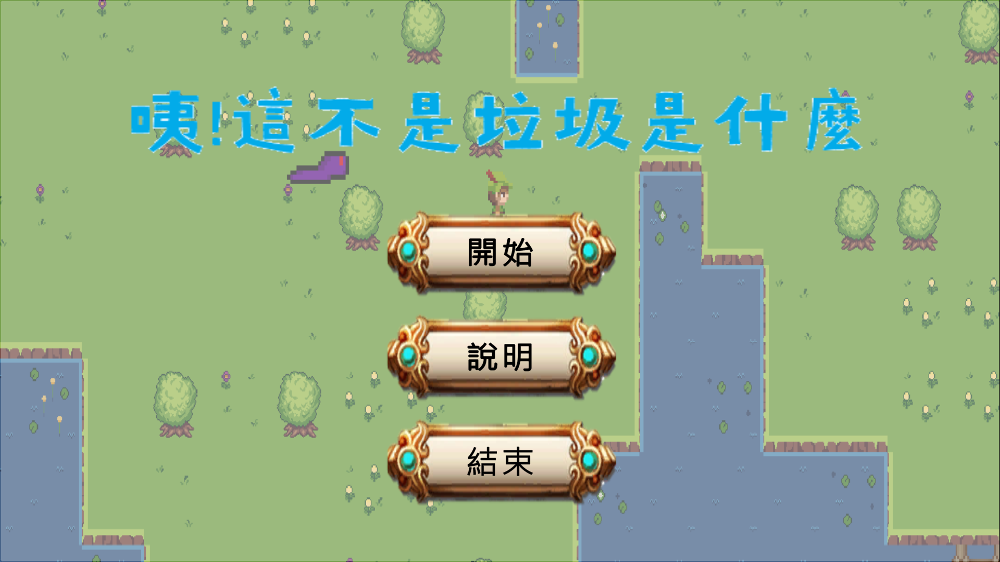
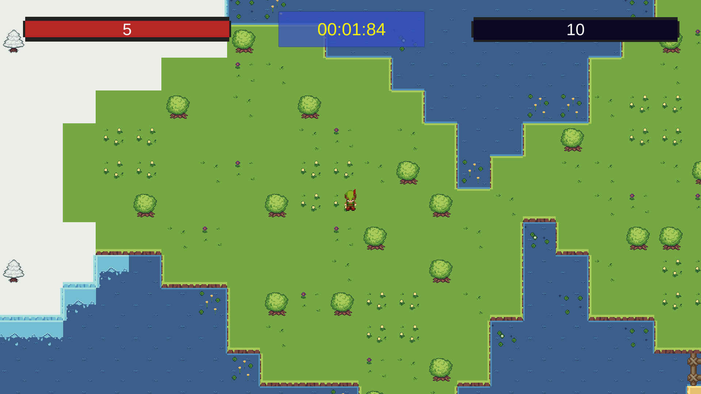
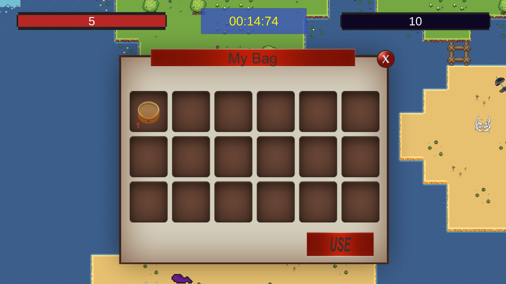
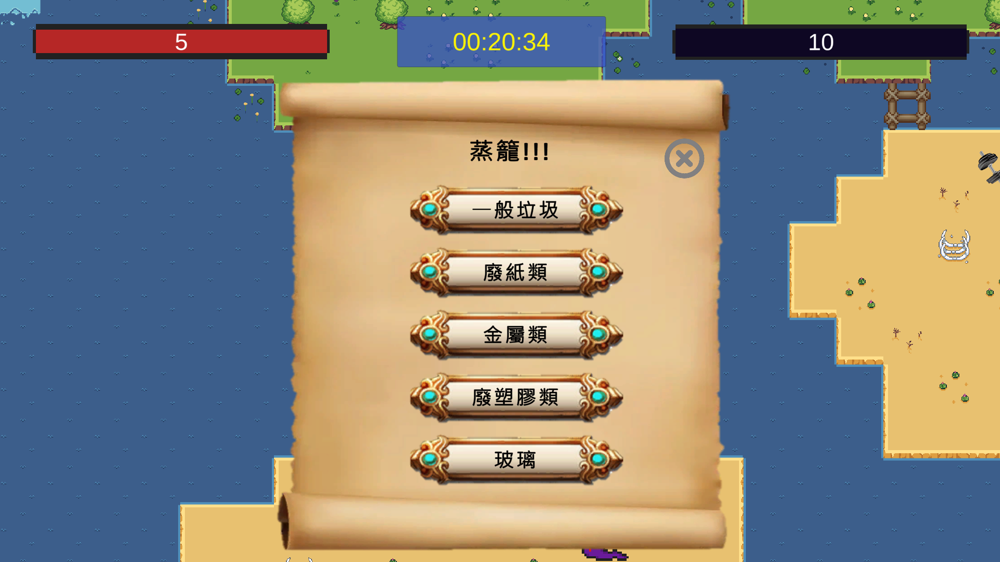

# RecycleGame

此為元智大學 1112 互動視訊遊戲設計課程的期末專案，與組員 [Daniel](https://github.com/daniel91125) 透過 Unity 一同開發而成。

Unity Hub 3.4.2 
Editor Version: 2021.3.24f1

## 開啟方式

1. 原始碼: clone 本專案或[下載](https://github.com/larrylai19/RecycleGame/archive/refs/tags/v1.0.zip)並解壓縮後使用 Unity Hub 開啟
2. 僅遊玩: [下載](https://github.com/larrylai19/RecycleGame/releases/download/v1.0/RecycleGame.zip)並解壓縮後執行 "Unity-Recycle-Game.exe"

## 遊戲介紹

垃圾分類對於環境保護至關重要。通過正確分類和回收，我們可以減少資源浪費、降低污染、延長資源的使用壽命。垃圾分類還能促進循環經濟，創造就業機會，並培養人們的環保意識和責任感。

然而垃圾分類並非是一件簡單的事情，發展至今垃圾擁有非常多的種類，常發生某個垃圾不知道該分到什麼類的情況，因此我們開發了這款遊戲 **咦!這不是垃圾是什麼**，希望讓玩家透過這款遊戲了解一些不常見的垃圾應該分到什麼類。

在遊戲中玩家扮演一位探險使者，需要到草地、冰原、沙漠等地方收集垃圾並分類，遊玩過程中能夠學習到不常見的垃圾該分什麼類，探索垃圾的同時還要躲避怪物的追擊，真是十分刺激，搭配非常好聽的背景音樂和音效，彷彿有身歷其境的臨場感，非常喝勝。

## 遊戲玩法

玩家有五點生命值，碰觸到地圖上的垃圾後會自動將垃圾收集進背包，打開背包可對垃圾進行分類，若分類錯誤垃圾會消失並於地圖上隨機生成，且會扣除玩家一點生命值。地圖上散佈許多蛇，若玩家被蛇碰觸到也會扣除玩家一點生命值，於生命值歸零前將所有垃圾正確分類完成即通關。

## 遊戲操作

移動: W, A, S, D 或方向鍵
背包: I
垃圾分類: 打開背包後點擊垃圾按下 USE
回到重生點: B
遊戲中選單: ESC

## 遊戲介面

### 選單畫面

### 主畫面

左上角為當前生命值，中間為計時器，右上角為當前還剩餘多少垃圾沒有分類

## 背包畫面

## 分類畫面

